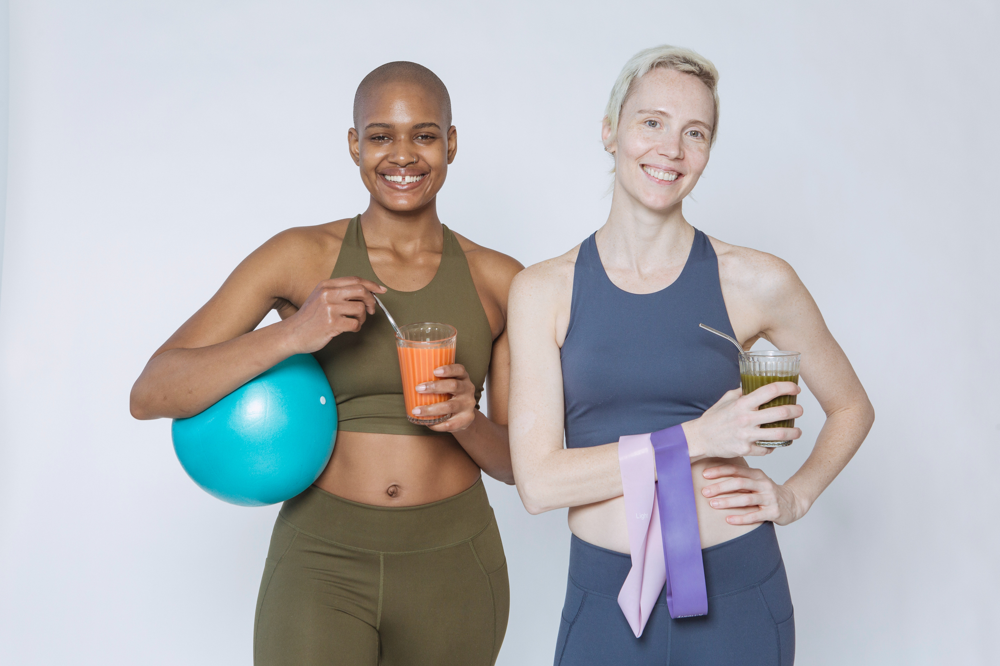

<!DOCTYPE html>
<html lang="en" dir="ltr">
  <head>
    <meta charset="utf-8">
    <meta name="viewport" content="width=device-width, initial-scale=1.0">
    <title>Evgeniya Titkova Sales Website</title>
    <link rel="stylesheet" href="https://cdnjs.cloudflare.com/ajax/libs/font-awesome/5.13.0/css/all.min.css" integrity="sha256-h20CPZ0QyXlBuAw7A+KluUYx/3pK+c7lYEpqLTlxjYQ=" crossorigin="anonymous" />
    <link rel="stylesheet" href="css/style.css" media="screen">
  </head>
  <body>
    

      

        

          
        

        

          <h1 class="name">Nutrition and Fitness Coaching</h1>
          <h4 class="quote">"Our Food Should be Our Medicine & Our Medicne Should Be Our Food"</h6>
          <h4 class="author"><i>- Hyppocrates</i></h4>
        

        

        

          

            

              
 Bring a friend, Get 20% OFF each program

              
Valentines deal: sign up and get free couple workout

              
Get a free 15 minute consultation 

            

          

          
        

        <!-- //Product line -->
        

          

              
              

              <h3>Workout plan 1 Month</h3>
              <h2> $500</h2>
              
3 workout sesion a week

              
Individual program

             

             <a href="#modalWindow1" class="open">Click here</a>

         

         

             
             

             <h3>Workout + Nutrition support</h3>
             <h2> $650</h2>
             <ul>
               <li>3 workouts per week</li>
               <li>Nutrition support</li>
               <li>Free full body workout  for the new member</li>
             </ul>
            

            <a href="#modalWindow2" class="open">Click here</a>

        

        

            
            

            <h3> 21 Day Nutrition plan</h3>
            <h2> $250</h2>
            <ul>
              <li>It takes 21 day to form a habit</li>
              <li>Daily reports</li>
              <li>Individual nutrition table</li>
            </ul>
           

             <a href="#modalWindow3" class="open">Click here</a>
         

        

<footer class="footer">

  

    

      <a class="linkTop" onclick="scrollTop()">&#x261D;To the top</a>
    

   <a href="https://www.facebook.com/"><i class="fab fa-facebook social "></i></a>
    <a href="https://www.instagram.com/?hl=en"><i class="fab fa-instagram social"></i></a>
    <a href="https://mail.google.com/mail/u/0/#inbox"><i class="fas fa-at social"></i></a>
  

  <small>&copy; Copyright 2022, Evgeniya Titkova. All rights reserved.  NOTE: All information and materials used only for educational purposes.</small>
</footer>

    

    <!-- Modal Window -->
    

       

          <a href="#close" class="close">&#9746;</a>
          

              
          

          

            <h4 id="productName">Workout plan 1 Month</h4>
            <ul>
              <li>Updated custom nutrition plans weekly to adjust to your individual needs</li>
              <li>Four 15-minute phone consultations </li>
              <li>Ayurvedic Testing (to understand your nature and individuality)</li>
              <li>Daily reports in form of pictures of everything you eat (to understand your individual eating habits and timing between meals)</li>
            </ul>
            
Price : $500 

                     
 
                     <form class="form1" method="get" action="checkout.html">

                        <label for="quantity">Quantity <input type="number" id="quantity" name="quantity" min="1" max="2" /></label>
                        <input  class="addToCart" type="submit" value="submit" onclick="passValue();" />
                    </form>
        

      

    

    <!-- end of Modal window -->
    <!-- Modal Window -->
    

       

          <a href="#close" class="close">&#9746;</a>
          

              
          

          

            <h4 id="productName" >Workout + Nutrition support</h4>
            <ul>
              <li>Updated custom nutrition plans weekly to adjust to your individual needs</li>
              <li>Four 15-minute phone consultations </li>
              <li>Ayurvedic Testing (to understand your nature and individuality)</li>
              <li>Daily reports in form of pictures of everything you eat (to understand your individual eating habits and timing between meals)</li>
            </ul>
            
Price : $650 

                     
 
                     <form class="form2" method="get" action="checkout.html">

                        <label for="quantity">Quantity <input type="number" id="quantity" name="quantity" min="1" max="2" /></label>
                        <input  class="addToCart" type="submit" value="submit" onclick="passValue();" />
                    </form>
        

      

    

    <!-- end of Modal window -->
    <!-- Modal Window -->
    

       

          <a href="#close" class="close">&#9746;</a>
          

              
          

          

            <h4 id="productName">21 Day Nutrition plan</h4>
            <ul>
              <li>It takes 21 day to form a habit</li>
              <li>Daily reports</li>
              <li>Individual nutrition table</li>
              <li>Daily reports in form of pictures of everything you eat (to understand your individual eating habits and timing between meals)</li>
            </ul>
            
Price : $250 

                     
 
                     <form class="form3" method="get" action="checkout.html">

                        <label for="quantity">Quantity <input type="number" id="quantity" name="quantity" min="1" max="2" /></label>
                        <input  class="addToCart" type="submit" value="submit" onclick="passValue();" />
                    </form>
        

      

    

    <!-- end of Modal window -->
    

  </body>
</html>
